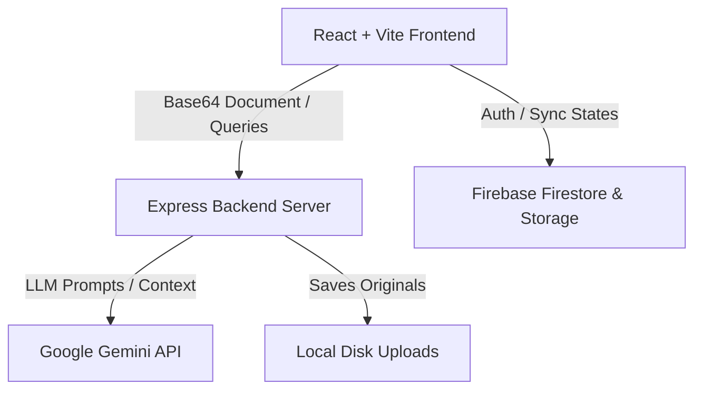

# <p align="center"><br>JurisAI</p>

<p align="center">
  <strong>Premium AI-Powered Contract Intelligence & Verification Suite</strong>
</p>

<p align="center">
  
  
  
  
  
</p>

---

## 🎓 Academic Project Information
This project was conceptualized and developed as a core part of the **Generative AI Course Project** by **Group 36**:
* **Group Head:** Siddhant Prasad
* **Course Domain:** Generative AI & Legal Tech Operations

---

## 📂 Testing PDFs
For quick testing and evaluation of the JurisAI platform, we have provided a dedicated folder:
*   [test/](file:///c:/Users/Siddhant/OneDrive/Desktop/JurisAI/test) - Contains 4 sample contract PDF files for direct upload, parsing, and testing of the intelligent clause extraction and risk analysis engine.

---

## 🌟 Key Features
JurisAI transforms complex, wordy contract agreements into plain-English briefings and visual reports for non-lawyers while maintaining professional verification matrices:

*   📂 **Layout Parser**: Converts PDF and DOCX documents into clean, structured sections.
*   🧠 **AI Clause Extraction**: Identifies 15 standard clauses (e.g. Indemnity, Liability, Terminations) with confidence indexes.
*   🛡️ **Risk & Compliance**: Evaluates financial, legal, operational, and reputational risks.
*   💡 **Executive Briefings**: Plain-English, business, and legal summaries at a single click.
*   📋 **Report Exporting**: Dynamic, structured PDF and DOCX reports with automated text sanitization (converting unicode characters like `₹` to safe standard representations).
*   🧪 **Testing & Verification Console**: A dedicated dashboard for faculty rating, comprehension logs, and evaluation metrics.

---

## 🏗️ System Architecture



### Tech Stack Specifications:
1.  **Frontend**: React, TypeScript, Vite, TailwindCSS (for utility structures), Framer Motion (premium micro-animations), Lucide icons.
2.  **Backend**: Node.js, Express, `pdf-lib` (custom PDF layout engine), `mammoth` (DOCX parser).
3.  **LLM Layer**: Google Gemini Developer API using `gemini-2.5-flash` for completions and `gemini-embedding-2` for vectors.
4.  **Database**: Cloud Firestore (NoSQL realtime database).
5.  **Storage**: Firebase Cloud Storage for parsed asset management.

---

## 🚀 Deployed URLs
*   **Backend Live Server (Render)**: [https://jurisai-feks.onrender.com](https://jurisai-feks.onrender.com)
*   **Health Check**: [https://jurisai-feks.onrender.com/health](https://jurisai-feks.onrender.com/health)

---

## 🛠️ Local Installation & Setup

### Prerequisites
*   Node.js (v18+)
*   Firebase Project Credentials

### 1. Clone & Configure the Backend
Navigate to the `server/` directory:
```bash
cd server
```

Create a `.env` file inside `server/` and fill in:
```env
PORT=5001
FIREBASE_PROJECT_ID=jurisai-13ad0
GEMINI_API_KEY=your_gemini_api_key
GEMINI_MODEL=gemini-2.5-flash
GEMINI_EMBEDDING_MODEL=gemini-embedding-2
```

Install packages and run:
```bash
npm install
npm run dev
```

### 2. Configure the Frontend
Navigate to the root directory and create a `.env` file:
```env
VITE_FIREBASE_API_KEY=your_api_key
VITE_FIREBASE_AUTH_DOMAIN=jurisai-13ad0.firebaseapp.com
VITE_FIREBASE_PROJECT_ID=jurisai-13ad0
VITE_FIREBASE_STORAGE_BUCKET=jurisai-13ad0.firebasestorage.app
VITE_FIREBASE_MESSAGING_SENDER_ID=your_sender_id
VITE_FIREBASE_APP_ID=your_app_id
```

Install packages and run:
```bash
npm install
npm run dev
```

---

## 📦 Deployment Guide

### Backend (Railway / Render)
1.  Create a web service pointing to your repository.
2.  Set the **Root Directory** as `server`.
3.  Configure variables: `PORT=5001`, `GEMINI_API_KEY`, `GEMINI_MODEL`, `GEMINI_EMBEDDING_MODEL`, `FIREBASE_PROJECT_ID`.
4.  Configure CORS on backend (currently set to dynamically allow the production origin).

### Frontend (Firebase Hosting / Vercel)
1.  Initialize Firebase Hosting in the root directory:
    ```bash
    firebase init hosting
    ```
2.  Point to `dist` as the build folder and configure as a Single Page App.
3.  Compile:
    ```bash
    npm run build
    firebase deploy --only hosting
    ```
